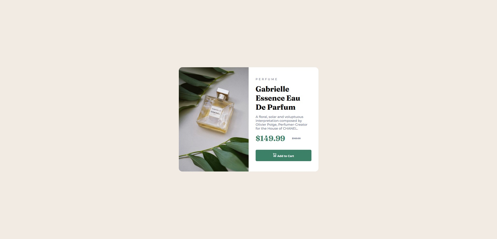
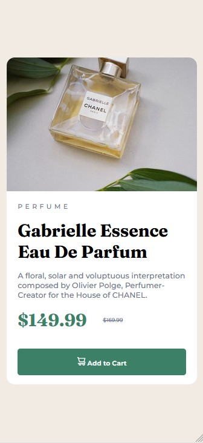

# Frontend Mentor - Product preview card component solution

## Table of contents

- [Overview](#overview)
  - [The challenge](#the-challenge)
  - [Screenshot](#screenshot)
  - [Links](#links)
- [My process](#my-process)
  - [Built with](#built-with)
  - [What I learned](#what-i-learned)
  - [Continued development](#continued-development)
- [Author](#author)

**Note: Delete this note and update the table of contents based on what sections you keep.**

## Overview

### The challenge

Users should be able to:

- View the optimal layout depending on their device's screen size
- See hover and focus states for interactive elements

### Screenshot





### Links

- Solution URL: [Solution URL here](https://github.com/R3B3-888/product-preview-card-component)
- Live Site URL: [Live site URL here](https://r3b3-888.github.io/product-preview-card-component/)

## My process

### Built with

- Semantic HTML5 markup
- CSS custom properties
- Flexbox
- Responsive

### What I learned

```css
@media screen and (max-width: 375px)
{
  main {
    flex-direction: column;
    width: 350px;
    height: 600px;
    justify-content: flex-start;
  }
}

main button {
  cursor: pointer;
  ...
}
```

`auto` as value to height to fit the content to the size need in a card, padding + texts + images

### Continued development

Cropping the desktop image for the mobile image, instead of using `display: none` for each image type in each context.

## Author

- Website - [Alexis Hoffmann](https://alexis-hoffmann.emi.u-bordeaux.fr/)
- Frontend Mentor - [@R3B3-888](https://www.frontendmentor.io/profile/R3B3-888)
